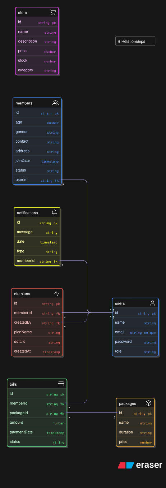

# gym-management-system

# Full Project Structure

gym-management-system/
├── frontend/                   # Next.js Frontend (App Router)
│   ├── app/
│   │   ├── layout.js           # Global layout (navbar, footer)
│   │   ├── page.js             # Landing/Home page
│   │   ├── login/
│   │   │   └── page.js
│   │   ├── dashboard/
│   │   │   └── page.js
│   │   ├── members/
│   │   │   └── page.js
│   │   ├── billing/
│   │   │   └── page.js
│   │   ├── notifications/
│   │   │   └── page.js
│   │   ├── store/
│   │   │   └── page.js
│   │   └── diet/
│   │       └── page.js
│   │
│   ├── components/
│   │   ├── Navbar.js
│   │   ├── Sidebar.js
│   │   ├── MemberForm.js
│   │   ├── BillCard.js
│   │   └── NotificationCard.js
│   │
│   ├── lib/
│   │   └── api.js              # Axios/fetch API utility
│   │
│   ├── context/
│   │   └── AuthContext.js      # For managing user state
│   │
│   ├── hooks/
│   │   └── useAuth.js
│   │
│   ├── styles/
│   │   └── globals.css
│   │
│   ├── public/
│   │   └── logo.png
│   │
│   ├── next.config.js
│   ├── package.json
│   └── tailwind.config.js
│
└── backend/ 
    ├── public                 
    │    ├ temp
    │        └── gitignore
    ├── src                   # Express.js Backend
    │    ├── index.js               # Entry point
    │    ├── constats.js            # constant Variables
    │    ├── config/
    │    │   └── db.js               # MongoDB connection
    │    │
    │    ├── models/                 # MongoDB schemas
    │    │   ├── User.js
    │    │   ├── Member.js
    │    │   ├── Package.js
    │    │   ├── Bill.js
    │    │   ├── Notification.js
    │    │   ├── StoreItem.js
    │    │   └── DietPlan.js
    │    │
    │    ├── routes/                 # API routes
    │    │   ├── authRoutes.js
    │    │   ├── memberRoutes.js
    │    │   ├── packageRoutes.js
    │    │   ├── billRoutes.js
    │    │   ├── notificationRoutes.js
    │    │   ├── storeRoutes.js
    │    │   └── dietRoutes.js
    │    │
    │    ├── controllers/            # Route logic
    │    │   ├── authController.js
    │    │   ├── memberController.js
    │    │   ├── packageController.js
    │    │   ├── billController.js
    │    │   ├── notificationController.js
    │    │   ├── storeController.js
    │    │   └── dietController.js
    │    │
    │    ├── middleware/
    │    │   ├── authMiddleware.js   # JWT validation
    │    │   └── errorHandler.js
    │    │
    │    ├── utils/
    │    │   └── logger.js           # Winston/Morgan logs
    │    │
    │    ├── tests/                  # Jest tests
    │    │   └── auth.test.js
    │    │
    ├── .env
    ├── .gitignore
    ├── package.json
    └── README.md
    
# Packeges 

* express
* mongoose 
* dotenv 
* bcrypt
* jsonwebtoken
* morgan 
* cors
* nodemon

# ER Diagram for models 

# API Endpoints

| Entity        | Endpoint               | Method   | Description             |
| ------------- | ---------------------- | -------- | ----------------------- |
| Auth          | `/api/auth/login`      | POST     | Login admin/member      |
|               | `/api/auth/register`   | POST     | Register user           |
| Members       | `/api/members`         | GET      | Get all members         |
|               | `/api/members/:id`     | GET      | Get member by ID        |
|               | `/api/members`         | POST     | Add member              |
|               | `/api/members/:id`     | PUT      | Update member           |
|               | `/api/members/:id`     | DELETE   | Delete member           |
| Packages      | `/api/packages`        | GET/POST | Membership plans CRUD   |
| Billing       | `/api/bills`           | POST     | Create bill             |
|               | `/api/bills/:memberId` | GET      | View bills for a member |
| Notifications | `/api/notifications`   | POST     | Send reminder           |
| Store         | `/api/store`           | GET/POST | Store items CRUD        |
| Diet          | `/api/diet`            | GET/POST | Diet plans CRUD         |
